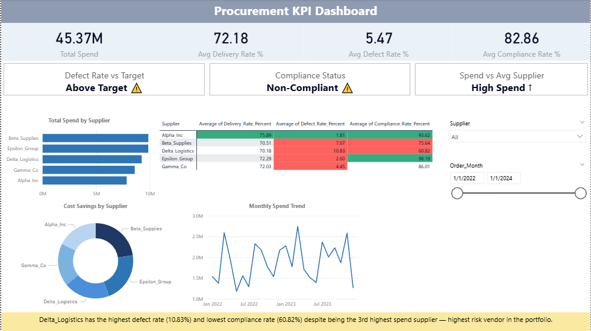
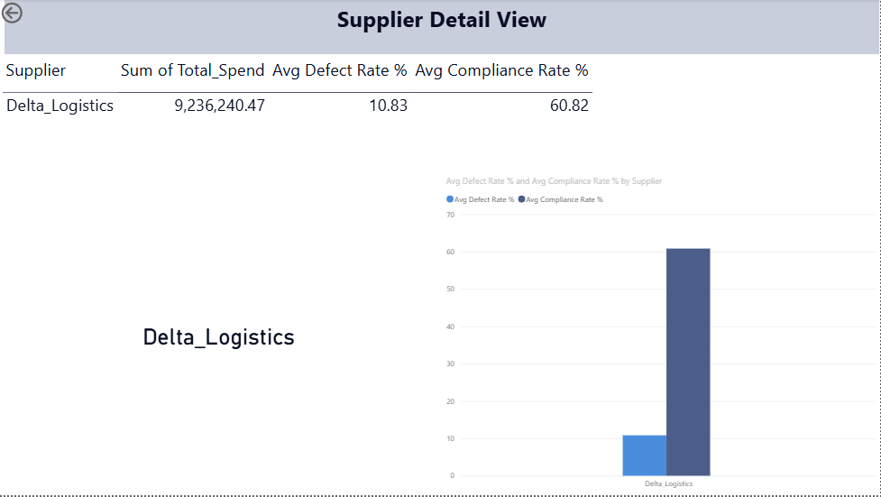
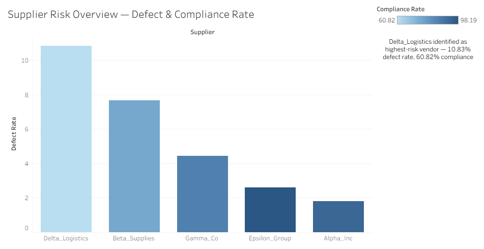

# Procurement KPI & Vendor Risk Dashboard

**Tools:** SQL (MySQL) · Microsoft Excel · Power BI · Tableau · DAX  
**Dataset:** 777 Purchase Orders · 5 Suppliers · 6 KPI Dimensions

---

## Project Overview

End-to-end procurement analytics pipeline to identify vendor risk, track cost savings, and monitor KPIs across 777 purchase orders. Built SQL queries for data extraction, structured the dataset in Excel, and visualised findings across two dashboards — an interactive Power BI dashboard for KPI tracking and drill-through analysis, and a Tableau dashboard for supplier risk visualisation.

---

## Business Questions Answered

- Which supplier poses the highest risk across defect rate, compliance, and spend?
- How much cost savings were achieved through price negotiation per supplier?
- What is the month-over-month procurement spend trend?
- Which suppliers have the lowest on-time delivery rates?

---

## Key Findings

| KPI | Finding |
|-----|---------|
| Highest-Risk Vendor | Delta Logistics — 10.83% defect rate, 60.82% compliance (lowest of 5 suppliers) |
| Total Spend | Rs. 9.2M on Delta Logistics despite lowest compliance |
| Cost Savings | Identified via negotiated vs. unit price comparison across all suppliers |
| Delivery Performance | Ranked all 5 suppliers by on-time delivery rate |

---

## SQL Queries (`procurement_kpi_queries.sql`)

6 queries covering:

1. **Total Spend Per Supplier** — quantity × negotiated price with spend % share
2. **Supplier Delivery Rate %** — on-time delivery by supplier
3. **Cost Savings Per Supplier** — original vs. negotiated cost comparison
4. **Supplier Defect Rate %** — defective units as % of total received
5. **Monthly Procurement Trend** — MoM order count and spend
6. **Supplier Compliance Rate %** — % of orders meeting compliance requirements

Techniques used: `GROUP BY`, `CASE WHEN`, window functions (`SUM() OVER()`), `DATE_FORMAT`, aggregate functions.

---

## Files

| File | Description |
|------|--------------|
| `procurement_kpi_queries.sql` | All 6 MySQL queries |
| `Procurement_Analysis.xlsx` | Cleaned dataset with Pivot Tables and VLOOKUP |
| `Procurement_KPI_Dashboard.pbix` | Interactive Power BI dashboard (DAX, drill-through) |
| `Procurement_Tableau_Dashboard.twbx` | Tableau dashboard — supplier risk (defect & compliance rate) |

---

## Dashboards

### Power BI — Main KPI Dashboard
Interactive dashboard with DAX measures and drill-through for spend, compliance, and delivery KPIs across all 5 suppliers.

### Power BI — Drill-Through: Supplier Detail View

### Tableau — Supplier Risk Overview (Defect & Compliance Rate)
Built separately in Tableau to visualise supplier risk positioning — plotting defect rate against compliance rate to flag Delta Logistics as the clear outlier despite highest spend.

---

## How to Use

1. Import `Procurement_Analysis.xlsx` into MySQL Workbench as `procurement_db`
2. Run queries from `procurement_kpi_queries.sql`
3. Open `Procurement_KPI_Dashboard.pbix` in Power BI Desktop
4. Open `Procurement_Tableau_Dashboard.twbx` in Tableau Desktop/Public

---

*Part of my Data Analyst portfolio — [LinkedIn](https://linkedin.com/in/ankita-halabanur) · [GitHub](https://github.com/ankita-halabanur)*
